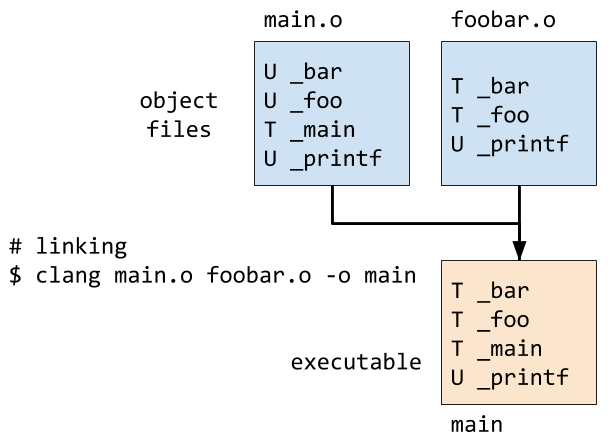

# CME212: Linking and Libraries

## Basics

One core part of *linking* is the process of connecting a function call with
code to execute the function at compile time (*static*) or run time (*dynamic*).

Understanding the linker is important in:

* Using external libraries such as [BLAS][blas] or [LAPACK][lapack]

* Making sure your program is making use of an optimized version of a particular
  library (e.g. [OpenBLAS][openblas], [ATLAS][atlas], [MKL][mkl])

* Using code written in other languages (e.g. [Fortran][fortran-link]
  and [C][c-link])

* Connecting a high-level language to an existing library

  * Julia: <http://docs.julialang.org/en/stable/manual/calling-c-and-fortran-code/>

  * Matlab: [MEX interface][mex] and [`loadlibrary`][load-library] (prefer
    `loadlibrary` if possible)

  * Python: so many ways!
    See: [Extending and Embedding the Python Interpreter][python-extend]

* Debugging compile time issues that involve the static linker (`ld`) and the
  runtime linker (`ldd`)

[blas]: http://www.netlib.org/blas/
[lapack]: http://www.netlib.org/lapack/
[openblas]: http://www.openblas.net/
[mkl]: https://software.intel.com/en-us/intel-mkl
[atlas]: http://math-atlas.sourceforge.net/
[fortran-link]: http://fortranwiki.org/fortran/show/Interoperability
[c-link]: https://en.wikipedia.org/wiki/Compatibility_of_C_and_C%2B%2B#Linking_C_and_C.2B.2B_code
[mex]: https://www.mathworks.com/help/matlab/ref/mex.html
[load-library]: https://www.mathworks.com/help/matlab/ref/loadlibrary.html
[python-extend]: https://docs.python.org/3/extending/index.html

## Example in plain C

Let's begin this discussion with a simple example. Say we have the following
source files in C (not C++).

`src/foobar.h`:

```c
#pragma once

// return a + 42
int foo(int a);

// say hi
void bar();
```

`src/foobar.c`:

```c
#include <stdio.h>

int foo(int a) {
  return a + 42;
}

void bar() {
  printf("hello from bar()!\n");
}
```

`src/main.c`:

```c
#include <stdio.h>
#include "foobar.h"

int main() {
  // call foo
  int c = foo(0);
  printf("c = %d\n",c);

  // call bar
  bar();
}
```

Now let's compile `foobar.c` into an *object file* (`.o`) and inspect the
*symbol table* with the `nm` command line tool (on macOS):

```sh
$ clang -c foobar.c -o foobar.o
$ ls
foobar.c	foobar.h	foobar.o	main.c
$ nm foobar.o
0000000000000020 T _bar
0000000000000000 T _foo
                 U _printf
```

Details:

* `$ clang -c` compiles the C source into machine code and stores the result in
  an *object file* (`foobar.o`). The object file contains the binary
  representation of the program that can be executed by the CPU.

* Machine code for specific functions are referenced by *symbols*. It can be
  helpful to think of symbols as machine code function names. The command
  `$ nm foobar.o` prints out the symbol table for `foobar.o`.

  * The first column is a memory offset in bytes

  * The second column gives information (`T` indicates that object file has code
    for thesymbol, `U` indicates "undefined"). The `printf` function sits
    somewhere else.

  * The last column gives the symbol name. Note how the symbol name is almost
    exactly the name of the C function. The macOS ABI prefixes function names
    with an underscore (`_`).  Exercise: what happens on Linux?

Now, let's compile `main.c` and link the whole thing together:

```sh
# compile main.c
$ clang -c main.c -o main.o
# inspect symbol table for main.o
$ nm main.o
                 U _bar
                 U _foo
0000000000000000 T _main
                 U _printf
# note that symbols for _bar and _foo are undefined
# the are defined in foobar.o and connected by the static linker:
$ clang main.o foobar.o -o main
# we can inspect the symbol table of an executable
$ nm main
0000000100000000 T __mh_execute_header
0000000100000f50 T _bar
0000000100000f30 T _foo
0000000100000ef0 T _main
                 U _printf
                 U dyld_stub_binder
# finally we can run the program
$ ./main
c = 42
hello from bar()!
```

Let's see it in a diagram:



The `_printf` symbol will be dynamically linked at run time.

If we neglect to tell the compiler about `foobar.o`, we get a compile time link
error:

```sh
$ clang main.o -o main
Undefined symbols for architecture x86_64:
  "_bar", referenced from:
      _main in main.o
  "_foo", referenced from:
      _main in main.o
ld: symbol(s) not found for architecture x86_64
clang: error: linker command failed with exit code 1 (use -v to see invocation)
```

## Symbol mangling (C++)

C is a very simple language. There is no function overloading based on argument
types, so a function name in C can be directly translated to a symbol name in
the binary format (macOS chooses to prefix with `_`).

C++ is more complicated with the presence of namespaces, function overloading,
and templates. Diagnosing symbol references with C++ code can be a pain. Let me
show you a cool trick.

Here is a simple C++ source file with and overloaded function `foo`,
`foobar.cpp`:

```c+
namespace foobar {
  double foo(double a) {
    return a + 42.0;
  }
  int foo(int a) {
    return a + 42;
  }
}
```

Let's compile into an object file `foobar.cpp.o` and inspect the symbols:

```sh
$ clang++ -std=c++11 -c foobar.cpp -o foobar.cpp.o
$ nm foobar.cpp.o
0000000000000000 T __ZN6foobar3fooEd
0000000000000020 T __ZN6foobar3fooEi
$ nm foobar.cpp.o | c++filt
0000000000000000 T foobar::foo(double)
0000000000000020 T foobar::foo(int)
```

Details:

* Information for the namespace and argument types for a function needs to be
  encoded in the symbol name so the linker can connect function calls at a later
  stage. This encoding is handled by "name mangling". The symbol for the
  `double` version of `foo` is `__ZN6foobar3fooEd`.

* Mangled names are not easy for humans to read, so there is a handy tool called
  `c++filt`. If you pipe stuff to `c++filt`, it will attempt to demangle C++
  symbols into what you'd expect to see in code.

## Application Binary Interface

See: <https://en.wikipedia.org/wiki/Application_binary_interface>

> Application binary interface
>
> In computer software, an application binary interface (ABI) is the interface
> between two program modules, one of which is often a library or operating
> system, at the level of machine code. An ABI determines such details as how
> functions are called and in which binary format information should be passed
> from one program component to the next, or to the operating system in the case
> of a system call.
>
> Adhering to ABIs (which may or may not be officially standardized) is usually
> the job of the compiler, OS or library writer, but application programmers may
> have to deal with ABIs directly when writing programs in a mix of programming
> languages, using foreign function call interfaces between them.
>
> ABIs differ from application programming interfaces (APIs), which similarly
> define interfaces between program components, but at the source code level.

## Calling compiled C code from C++

C++ mangles function names while C does not. We often want to call functions
written and compiled with C from C++ (or visa versa). C++ provides the `extern`
keyword to designate external linkage for functions.  Let's see how it works:

`extern/c_function.h`:

```c
#ifdef __cplusplus
extern "C" {
#endif

int add_three(int a);

#ifdef __cplusplus
}
#endif
```

Details:

* `__cplusplus` is a preprocessor macro that is defined when a C++ compiler is
  being used.  Thus, `extern "C"` will only be seen by a C++ compiler here.
  
* `extern "C" {...}` tells the compiler that name mangling is not used for
  symbols declared or defined in the brackets.

`extern/c_function.c`:

```c
#include "c_function.h"

int add_three(int a) {
  return a + 3;
}
```

`extern/cpp_main.cpp`:

```c++
#include <iostream>
#include "c_function.h"

int main() {
  std::cout << add_three(1) << std::endl;
}
```

Let's see it in action:

```sh
# compile the C function
$ clang -c c_function.c -o c_function.o
# inspect symbols
$ nm c_function.o
0000000000000000 T _add_three
# compile the C++ main and inspect symbols
$ clang++ -std=c++11 -c cpp_main.cpp -o cpp_main.o
$ nm cpp_main.o
0000000000000140 s GCC_except_table1
                 U __Unwind_Resume
# some C++ IO and string symbols omitted
                 U ___gxx_personality_v0
                 U _add_three
0000000000000000 T _main
# link together into one happy executable
$ clang++ cpp_main.o c_function.o -o cpp_main
$ ./cpp_main
4
```

**Exercise**: remove the `extern "C"` blocks from `c_function.h` and repeat the
process. What happens? Why does it not work?

**Note**: `extern` is also used to make C++ code callable in C. There are
restrictions. Any C++ function you want callable by C must not use overloading
or templates. Arguments may be primitive types, pointers, or C structs.
References and C++ classes are not permitted. Plain C is such a pervasive
language. If you write an interface to plain C, you are likely going to be able
to call your code from any other language.

## Libraries

There are many ways to distribute software.  You might consider:

* sending out or posting the source code

* distributing an executable

* producing a *library* that other people could use in their executable

* setting up a web service with some from of API

We're going to talk briefly about *libraries*. A *library* is a collection of
compiled code that can be linked against at compile time (static) or run-time
(dynamic).

* It is very common to use a library of object files instead of explicitly
  stating every object file to use when linking

* Libraries can be either static or dynamic

* In static libraries (`.a`), the object files are copied into the executable file

* In dynamic libraries (`.so`, `.dll`, `.dylib`), only the symbols are
  associated and the linking takes place at runtime by the runtime linker

* Most dynamic libraries can also be shared between many programs to save memory

### Creating static libraries (linux)

* A static library is put together by the `ar` command

* Static libraries are sometimes referred to as an archive (`.a`)

```sh
$ gcc -c triangle.c
$ ar cru libtriangle.a triangle.o
$ gcc -c program.c
$ gcc -o program program.o triangle.a
```

### Creating a dynamic library (linux)

* Dynamic shared libraries are created by the compiler where each object file
  should be compiled with `-fPIC`

* When using libraries the `lib` part of the name is removed at link time

```sh
$ gcc -c -fPIC triangle.c
$ gcc -shared -fPIC -Wl,-soname,libtriangle.so \
>       -o libtriangle.so triangle.o
$ gcc -c program.c
$ gcc -o program program.o -L<PATH> -ltriangle
```

### Checking dependencies

Let's create a simple C program to compute pi via a call to `atan`:

`pi.c`:

```c
#include <stdio.h>
#include <math.h>
int main(void) {
  double pi = 4.0*atan(1.0);
  printf("Pi is %lf\n",pi);
  return 0;
}
```

Let's inspect the dynamic library dependencies:

```sh
$ gcc -o pi pi.c -lm
$ ldd ./pi
  linux-vdso.so.1 =>  (0x00007fff215ff000)
  libm.so.6 => /lib/libm.so.6 (0x00007fb431ce5000)
  libc.so.6 => /lib/libc.so.6 (0x00007fb431962000)
  /lib64/ld-linux-x86-64.so.2 (0x00007fb431f89000)
```

## Binutils

Unix systems have a set of utilities for inspecting and modifying binary files.
These are collectively known as *Binutils*.

* Linux systems tend to use GNU Binutils: <https://www.gnu.org/software/binutils/>

* macOS uses the MACH-O binary file format. Some of the GNU Binutils are present
  on macOS.  `otool` is a macOS command line tool that replaces `ldd`.  I have
  not found a convenient list of macOS binutils.

## References

* Shared library
  HOWTO: <http://www.tldp.org/HOWTO/Program-Library-HOWTO/shared-libraries.html>

* Linux Programming Interface: <http://man7.org/tlpi/>

* <https://www.gnu.org/software/binutils/>
