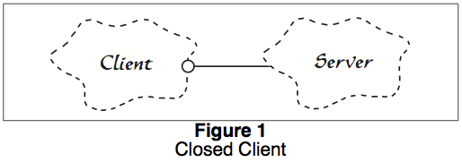
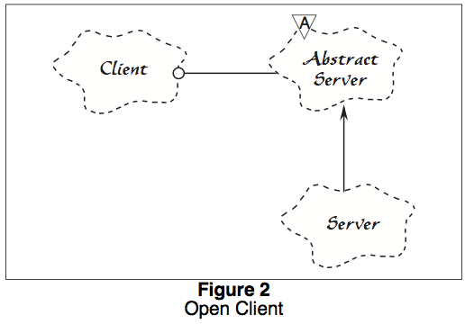

# CME 212: The Open-Closed Principle and Liskov Substitution Principle

### Intro

"Object oriented" features exist in many languages and were developed to promote
modularity, encapsulation, and safety in software systems. Over time a cottage
industry of tools, techniques, books, courses, conferences, etc grew to support
object oriented design and programming. Today, there exists many ideas in the
developer mindspace (e.g. only use `private` data members in classes) and
defined design patterns (as popularized by the famous
"Gang-of-Four" [book][gof])

There is substantial [debate][oop-criticism] on the value of object oriented
features and whether or not they actually promote modularity and encapsulation
(not too mention software developer sanity). In many situations, data structures
resulting from object-oriented modeling make performant parallelism difficult
(perhaps impossible).

[gof]: https://en.wikipedia.org/wiki/Design_Patterns
[oop-criticism]: https://en.wikipedia.org/wiki/Object-oriented_programming#Criticism

One of the most important features of OOP is inheritance to allow dynamic
polymorphism (run-time dispatch based on type) and express "is-a" relationships
in modeling of data (a Golden Retriever is-a Dog).

### Reminder: dynamic polymorphism via virtual functions

```c++
#include <iostream>

using std::cout;
using std::endl;

class A {
 public:
  virtual void foo() {
    cout << "A::foo() called." << endl;
  }
};

class B : public A {
 public:
  virtual void foo() {
    cout << "B::foo() called." << endl;
  }
};

void call_foo(A& a) {
  a.foo();
}

int main() {
  A a;
  B b;
  
  call_foo(a);
  call_foo(b);
}
```

See: <http://coliru.stacked-crooked.com/a/12da0a3f4c6ba591>

### Issues

Part of the purpose of CME212 is to train you to think formally and rigorously
about software. This is why we make you write formal specifications for your
functions. The existence of inheritance means that we can define a new type and
possibly pass it to a function and change the functions behavior. Thus the
programmer must take care to understand how the new type interacts with the pre
and post conditions of the original function.

There are many heuristics that are used to guide design choices in software
development (e.g. no global variables). Today we discuss two important
principles that can help govern the use of inheritance (and also be used to
derive some of the common heuristics).

## Open-Closed Principle

> Software entities (classes, modules, functions, etc.) should be open for
> extension, but closed for modification.

Keys:

* Software developers should design modules that **never change**

* When old requirements change or new requirements are realized, it should be
  possible to extend the module by adding new code and not changing old code.
  
### Client-server example

#### Closed client



In code:

```c++
class Server {
 public:
  Data get_data(Query q);
};

class Client {
 public:
  Client(Server* s);
  void print_data() {
    // ...
    Data d = s->get_data(q);
    // ...
  }
 private:
  Server* s_;
}
```

Let's say we started with a server that read files from disk. Then our boss
comes in and says "Hey software developers, I just hear about the internet. I
want our Client code to access a Server over the network!". In the above design,
we'd have to change the code as it is not open for extension.

#### Open client



In code:

```c++
class AbstractServer {
 public:
  virtual Data get_data(Query q) = 0; 
};

class DiskServer : public AbstractServer {
 public:
  Data get_data(Query q);
};

class NetworkServer : public AbstractServer {
 public:
  Data get_data(Query q);
};

class Client {
 public:
  Client(Server* s);
  void print_data() {
    // ...
    Data d = s->get_data(q);
    // ...
  }
 private:
  Server* s_;
}
```

Inheritance allows us to implement abstraction so that `Client` is open for
extension without modifying the source code. Here we see a very useful form of
inheritance: a purely abstract interface class with concrete base classes.

### Drawing shapes

Let's say we are designing a system to draw shapes. It would be ideal if this
system allowed us to implement new shapes without modifying the old code.

#### Procedural implementation 

Plain C does not have the C++ features to implement abstraction or run-time type
information. Structures to represent shapes would need to maintain a *tag* that
could be used to determine type at run time.

```c
enum ShapeType {circle, square};

struct Shape {
  ShapeType itsType;
};

struct Circle {
  ShapeType itsType;
  double itsRadius;
  Point itsCenter;
};

struct Square {
  ShapeType itsType;
  double itsSide;
  Point itsTopLeft;
};

//
// These functions are implemented elsewhere
//
void DrawSquare(struct Square*)
void DrawCircle(struct Circle*);

typedef struct Shape *ShapePointer;

void DrawAllShapes(ShapePointer list[], int n) {
  int i;
  for (i=0; i<n; i++) {
  struct Shape* s = list[i];
    switch (s->itsType) {
     case square:
      DrawSquare((struct Square*)s);
      break;
     case circle:
      DrawCircle((struct Circle*)s);
      break;
    }
  }
}
```

The issue here is that when we implement a new shape (say `triangle`) we'd have
to modify `DrawAllShapes`. This sample requires modification if we want to
extend to new shapes.

#### Object-oriented approach

```c++
class Shape {
 public:
  virtual void Draw() const = 0;
};

class Square : public Shape {
 public:
  virtual void Draw() const;
};

class Circle : public Shape {
 public:
  virtual void Draw() const;
};

void DrawAllShapes(Set<Shape*>& list) {
  for (Iterator<Shape*>i(list); i; i++) {
    (*i)->Draw();
  }
}
```

To add a new shape to the system we create a new class and inherit from `Shape`.
The function `DrawAllShapes` can thus be extended without modification. This is
possible, because it only relies on the abstract behavior of `Shape`.

### Consequences of OCP

#### Data-members of classes should be `private`

Close for modification does not just mean "closed for source code
modifications". It also means closed to changes in data that may affect behavior
or violate invariants in the module. For this reason, member data in classes
should be `private` unless there is valid reason to expose the variable to
change.

For example, take a class that represents a device and has a public `status` flag:

```c++
class Device {
  // ...
 public:
  bool status;
  // ...
};
```

Code that uses `Device` can change the status:

```c++
Device d;
// ...
d.status = true;
// d may still be in an invalid state!
// an invariant is perhaps broken
```

`protected` data members are just as problematic, except it would be the
sub-class that is modifying the data.

Having non-`private` data members means that the module is open for
modification.

#### No global variables

Just like non-`private` data members of a class, the presence of a global
variable means that the module is open for modification by other parts of the
system.

## Liskov Substitution Principle

The Liskov Substitution Principle (LSP) provides guidance on the appropriate use
of inheritance. One stated version of LSP is:

> Functions that use pointers or references to base classes must be able to use
> objects of derived classes without knowing it.

More formally:

> If for each object `o1` of type `S` there is an object `o2` of type `T` such
> that for all programs `P` defined in terms of `T`, the behavior of `P` is
> unchanged when `o1` is substituted for `o2` then `S` is a subtype of `T`.

### A Simple LSP Violation

```c++
void DrawShape(const Shape& s) {
  if (typeid(s) == typeid(Square))
    DrawSquare(static_cast<Square&>(s));
  else if (typeid(s) == typeid(Circle))
    DrawCircle(static_cast<Circle&>(s));
}
```

* `DrawShape` must know about all derived classes of `Shape` in order to work
  properly.

* The behavior is changed if, say, a `Triangle` object (also a derivative of
  `Shape`) is passed to this version `DrawShape`. Nothing would happen, because
  there is no check for `Triangle`.

### Square and Rectangle, a More Subtle Violation

One might say: A square is a rectangle where the width is equal to the height.

An object-oriented designer might see the "is-a" relationship and design a class
model around it.  This presents several issues.  Let's work them out.

Here is a simple class to represent a rectangle:

```c++
class Rectangle {
 public:
  virtual void SetWidth(double w)  {itsWidth=w;}
  virtual void SetHeight(double h) {itsHeight=w;}
  double       GetHeight() const   {return itsHeight;}
  double       GetWidth() const    {return itsWidth;}
 private:
  double itsWidth;
  double itsHeight;
};
```

Here is a first pass at `Square`:

```c++
class Square : public Rectangle {  // a Square is-a Rectangle
  // all member functions inherited
};
```

Issue: `Square` does not maintain the invariant `itsWidth == itdHeight`.

Here is a second try:

```c++
class Square : public Rectangle {
 public:
  virtual void SetWidth(double w);
  virtual void SetHeight(double h);
};

void Square::SetWidth(double w) {
  Rectangle::SetWidth(w);
  Rectangle::SetHeight(w);
}

void Square::SetHeight(double h) {
  Rectangle::SetHeight(h);
  Rectangle::SetWidth(h);
}
```

Now `Square` maintains the invariant.  We should be happy right?

Consider the function:

```c++
void g(Rectangle& r) {
  r.SetWidth(5);
  r.SetHeight(4);
  assert(r.GetWidth() * r.GetHeight()) == 20);
}
```

This function would work for `Rectangle` objects, but not `Square` objects.
Thus, using inheritance in this manner has broken possibly exiting code,
violating OCP!

#### What went wrong?

* A square may be a rectangle

* A `Square` object is definitely not a `Rectangle` object -- the behavior on
  method calls is different.
  
* "The LSP makes clear that in object-oriented design the `is-a` relationship
  pertains to behavior. Not intrinsic private behavior, but extrinsic public
  behavior; behavior that clients depend upon."
  
#### Specifications

In the context of specifications, to satisfy the LSP:

> when redefining a routine (in a derived class), you may only replace its
> precondition by a weaker one, and its postcondition by a stronger one.

The `Rectangle::SetWidth(double w)` method has in implicit post-condition:

```c++
assert((itsWidth == w) && (itsHeight == old.itsHeight));
```

The post-condition of the method `Square::SetWidth(double w)` does not conform
to `(itsHeight == old.itsHeight)` and thus is weaker. Thus, the
`Square->Rectangle` relationship in this example violates the LSP.

## Wrap-up

* The **Open-Closed Principle** states that software modules should be closed
  for modification, but open for extension.
  
  * In C++ this may be implemented via abstraction through inheritance and
    also generic (template) functions.

  * Also a good design principle in other domains
  
* The **Liskov Substitution Principle** is a design rule that governs
  inheritance.
  
  * If methods in derived classes only weaken preconditions and strengthen
    postconditions, then the specifications met by any code expecting the base
    class will be met when presented with the derived class.

  * Watch out for implicit assumptions!  This is not easy.

* Overall, good OO design is very difficult. In practice, software systems that
  claim to have "good OOD" are in fact a nightmare.

* Be very careful with inheritance:
 
  * It is too easy to violate implicit conditions

  * Use inheritance to define an purely abstract interface for run-time dispatch
  
  * Do not use it for code
    reuse! <https://isocpp.org/wiki/faq/objective-c#objective-c-and-inherit>

  * Do not use it in an attempt to be cool -- it's normally a hard fail
