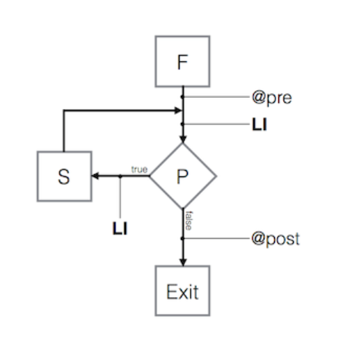

# Lecture 5

## Loop Invariants

We can use some of the same tools for reasoning about loops as we have used for classes and
methods: preconditions, postconditions, and invariants.

First, let's note that our standard for-loop consists of some first/setup statements `F`, a
predicate `P`, a next statement `N`, and body `S`:
```c++
for (F; P; N)
  S;
```
is equivalent to the while loop:
```c++
F;
while (P) {
  S; N;
}
```

To reason about this loop's behavior, we will add preconditions, postconditions, and a loop
invariant (`LI`) which is always true at the beginning and end of the loop.
```c++
F;
assert (@pre);
assert (LI);
while (P) {
  S; N;
  assert(LI);
}
assert (@post);
```
Or, diagrammatically:



From the code and diagram, we can see that our loop invariant will always be true if:

1: `@pre => LI`

2: `P+S=>LI`

and our postcondition will be satisfied if:

3: `(LI && !P) => @post`

Let us apply this reasoning to some code for computing the greatest common divisor.
```c++
 int a = orig_a;
 int b = orig_b;
 /* @pre: a >= 1,b >= 1 */
 while(a != b)
 {
   /* LI: a, b both divisible by gcd(orig_a, orig_b) */
   if(a > b)
     a = a - b;
   else /*b > a */
     b = b - a;
   /*LI: a, b both divisible by gcd(orig_a, orig_b) */
 }
 /* @post: gcd(orig_a, orig_b) ==a */
```
We satisfy requirement (1) `@pre => LI` by the definition of the GCD. We can reason that
requirement (2) `P + S => LI` is satisfied because if both `a` and `b` are divisible by GCD
and `(a-b)>0`, then `(a-b)` must also be divisible by GCD, and similarly for
`(b-a)>0`. Finally, for requirement (3), if `(LI && !P)` is true, then we know
that both `a` and `b` are divisible by the GCD and `(a==b)`, so `a` must be equal to the GCD.
If the precondition and postcondition are satisfied, we know the loop will exit with the correct
result, but we haven’t said anything about it actually exiting, yet. To reason about the loop
actually terminating, we add a decrementing function `DF`, with the requirement that `DF(X)`
decreases each iteration, and that:

4: `(P && LI) => DF(X+S) < DF(X)`

5: `(DF(X) == min) => !P`

where `X` is the program state, and in the first statement, `DF(X)` is the decrementing function
before `S` is executed, and `DF(X + S)` is its value afterward, and `min` is some minimum value
for `DF(X)`.

What `DF` should we use for the GCD example? Each loop must reduce `DF(X)`,
and it must reach some minimum value. A natural choice for `DF(X)` is `max(a,b)-GCD(a,b)`,
with `X=a,b` and `min==0`.

We satisfy (4) `(P && LI) => DF(X) < DF(X + S)` by the argument that decrementing the
larger of `a` or `b` lowers `max(a,b)`. Finally, if `DF(X)==0`, this means that `max(a,b)==GCD(a,b)`
which must mean that `a==b`, i.e., `!P`.

Hint: always use natural numbers for your `DF`, with a minimum of 0, to simplify reasoning
about loops.
