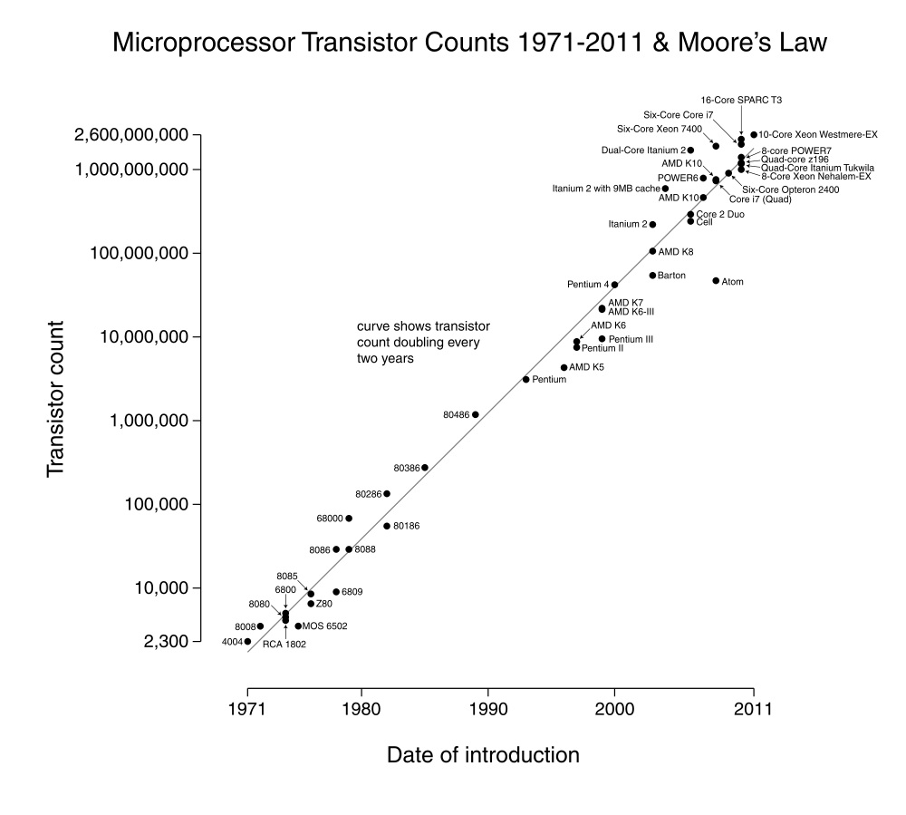
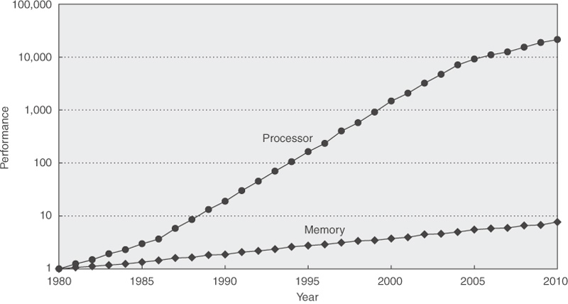
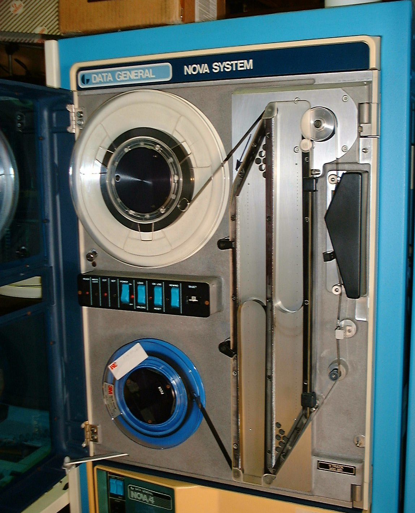
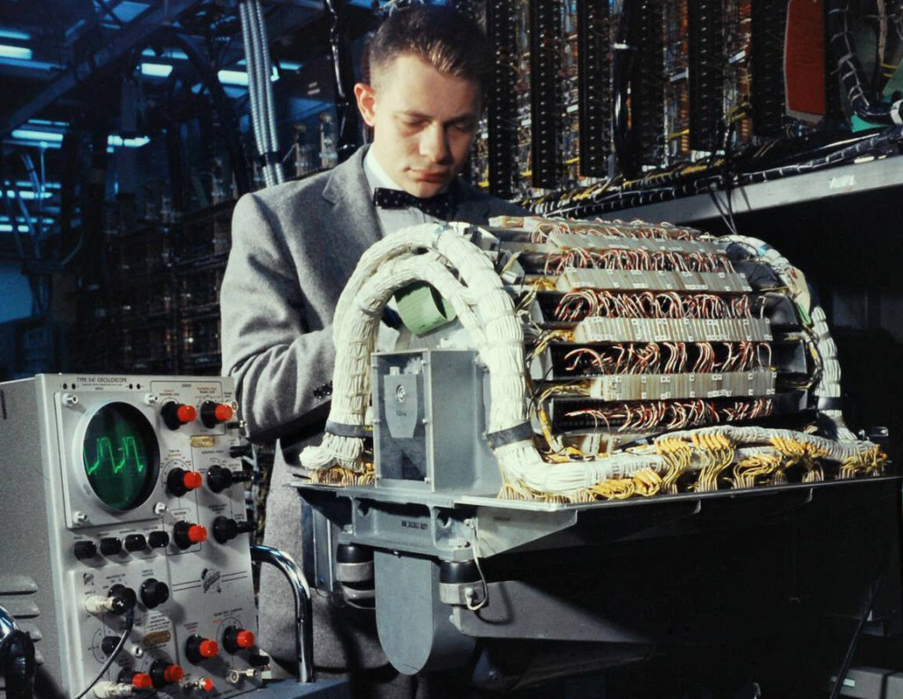
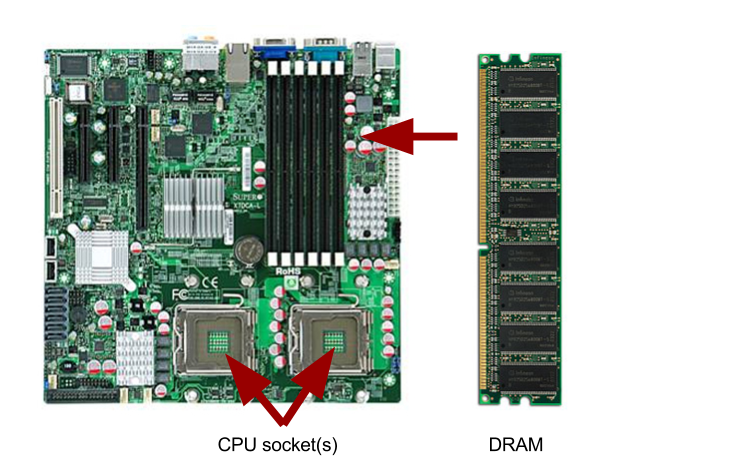
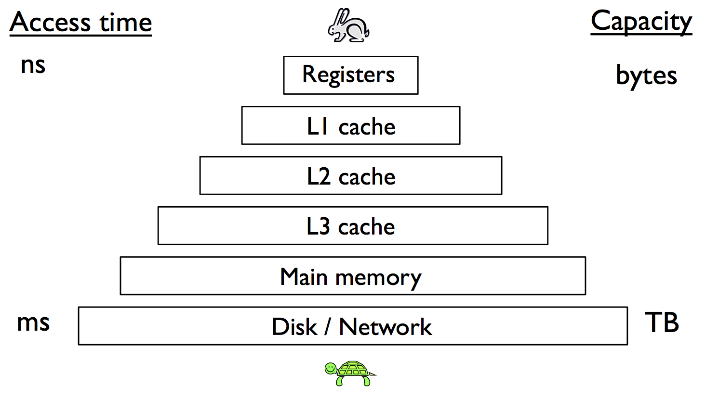
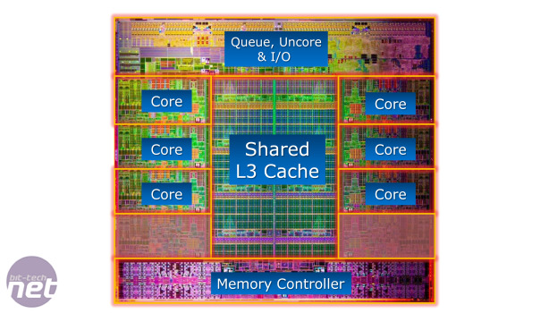
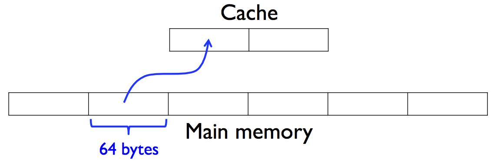
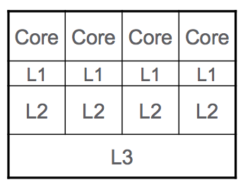

# CME 212: Lecture 15

## Memory & performance

* Memory systems
* Measuring run time
* Basic performance optimization (related to memory use)

## Motivation

Consider `Matrix` class defined in the example
[cachetest.cpp](src/cachetest.cpp), with elements laid out
in the memory in a row-major order. Now, let us
compute the sum of all matrix elements in a row-major order
```c++
double sumMatrixRow(Matrix& m)
{
  double sum = 0.0;
  int N = m.size();
  for(int i=0; i<N; ++i)
    for(int j=0; j<N; ++j)
      sum += m[i][j];
  return sum;
}
```
and the sum in a column-major order
```c++
double sumMatrixColumn(Matrix& m)
{
  double sum = 0.0;
  int N = m.size();
  for(int j=0; j<N; ++j)
    for(int i=0; i<N; ++i)
      sum += m[i][j];
  return sum;
}
```
and compare the performance of the two functions. When we run the code,
we get results that look like this:
```
$ g++ -O2 -Wall -Wconversion -Wextra -o test cachetest.cpp
$ ./test
Row-wise matrix sum:    3.20027e+07
Row-wise sum time:      0.388945
Column-wise matrix sum: 3.20027e+07
Column-wise sum time:   1.92557
```

### Important issues

* Memory access pattern had large impact on performance, compiler did not fix
  this for us.

* In the above example `timer()` was used to measure run time. In general,
  measurement of run time is non-trivial.

<!-- ## Thought experiment with GPUs -->

<!-- * The Nvidia Tesla K40 has a max single precision floating point performance of -->
<!--   4.29 Tflops -->

<!-- * Tesla K40 has max memory bandwidth of 288 GB/sec -->

<!-- * Say we carry out 1 flop per float moved from and to GPU memory on Tesla K40 -->

<!-- * 1 float = 4 bytes, total memory traffic is 8 bytes for read 288 GB/sec x 1 -->
<!--   flop / 8 bytes = 36 Gflops -->

<!-- * Max theoretical performance: 4.29 Tflops -->

<!-- * To achieve max flops: -->
<!--   * 4.29 Tflop/sec x 8 bytes/float / 288 GB/sec -->
<!--   * = ~120 flops per float moved over memory bus -->

## Moore's Law

Empirical observation made by Intel co-founder Gordon Moore in the 1960s that
it was economically feasible to double the number of transistors on a single
integrated circuit every 18 - 24 months; this enables more floating point operations per unit of time.



## Timing

CME212 used to have a whole lecture on timing. Measurement of program run time
will be affect by:

* The resolution of the clock used to measure run time.

* Other things going on in the system.

Key's to reliable performance measurement:

1. It's generally reliable to use wall-clock timers for things that take a long
   time (> than 1 second).

2. If you are trying to measure something fast (<< 1 second), you must record
   the time it takes for many repetitions. (`%timeit` in IPython and
   `@benchmark` in Julia do this automatically). 
   (However, beware that the first run of your computation will likely result in caching results in memory, whence subsequent iterations may complete faster than they otherwise normally would...) 

3. Do as little else on the system as possible.

4. Take many samples and average (use harmonic mean for rates)

See the included slides for more info. Also see the *Timing and Profiling*
chapter from **High Performance Computing** by Charles Severance and Kevin Dowd. Link: <http://cnx.org/contents/u4IVVH92@5.2:nnYUvM1W@3/Introduction>

## Memory

* Moore's Law also applies to memory manufacturing, and this is where we will be
  starting our look at computer architecture

* Over the years memory capacity has increased tremendously

* What about performance?

### Processor - Memory Gap



From: Computer Architecture: A Quantitative Approach by Hennessy and Patterson

### Random Access Memory (RAM)

* Original meaning was that random locations in memory could be accessed in
approximately the same amount of time

* As opposed to drum memory, tape drive, hard drive, etc., which requires sequential scanning through memory to find the "right location" where the data of interest resides.

Tape drive



Drum memory



### DRAM

* In Dynamic RAM (DRAM), each bit of data is stored using a combination of a
transistor and a capacitor

* Simple implementation allows for large capacity

* Capacitors leak charge so to maintain data integrity the charge has to
periodically be refreshed, hence the dynamic part

* Data cannot be read or written while the capacitor is being refreshed

* DRAM makes up the majority of the memory capacity in computers

* Modern computers typically have many Gigabytes (GB) of DRAM

* For example, each corn machine has 32 GB of DRAM memory

* High end machines may have hundreds of GBs of DRAM memory

### Physical implementation



### Data transfer performance

* There are two important parameters to characterize data transfer performance

* **Bandwidth**: rate at which data can be moved (typically MB/sec - GB/sec)

* **Latency**: time delay between requesting data and when you start receiving
it (typically nanoseconds to milliseconds)

* Can be used to characterize memory, network, and storage performance

### DRAM performance

* DRAM bandwidth depends on the number of memory channels and the clock rate of
the interface

  * Memory channels = pipelines
  * Clock rate = flow velocity

* More memory channels and higher clock rates are better, but more expensive

* Typical bandwidth for modern computers is 10 - 60 GB/sec (see for example
STREAM benchmark: http://www.streambench.org)

### DRAM latency

* Typical DRAM memory latencies are a bit difficult to quantify because it
varies with things like memory access pattern, CPU / memory topology, etc.

* Something in the range of 75 - 100 nanoseconds is a good rule of thumb

* Sounds fast right?

### Latency and clock cycles

* For a typical 3 GHz processor, DRAM memory latency corresponds to 225 - 300
clock cycles

```c++
float sum = 0.f;
for (unsigned int i = 0; i < nrows; i++) {
  for (unsigned int j = 0; j < ncols; j++) {
    sum += a[i][j];
  }
}
```

### Memory caches

* Clock speeds of modern processors would make no sense if each computation
required requesting the data, waiting 100s of clock cycles, performing the
computation, and then repeating

* To mitigate DRAM latency, data is cached in intermediate memory locations
called caches

* Hopefully most or all of the data we will need is in the caches, avoiding
costly waits for main memory access

### Cache hardware

* Caches are typically part of the CPU chip and usually implemented using Static
RAM (SRAM)

* SRAM is implemented using transistors, 4 - 6 per bit, and does not require
refresh

* SRAM is faster (higher bandwidth, lower latency) but is more limited in
capacity

* Typically implemented as a hierarchy of caches

* Sizes can vary from 10s of KBs up to 10s of MBs

### Memory hierarchy



### Chip real estate



Intel Sandy Bridge E processor

### Overall cache strategy

* When the processor needs a piece of information it first looks in L1

* If the data is in L1, it is a *cache hit*

* If the data is not in L1, it is a *cache miss*

* For a cache miss, we proceed on to L2, then L3, and finally main memory

* How do the caches get populated with
data?

### Cache lines

* Memory is divided into segments called cache lines

* 64 bytes is a typical cache line size

* Data is transferred in increments of cache line size

* A cache may be able to hold anywhere from 1000s to 100,000s of cache lines



### Cache organization

* Process of pairing main memory locations with cache lines is called *mapping*

* Fully associative cache

  * Any memory location can be mapped to any cache line

* Direct mapped cache

  * A memory location is always mapped to the same cache line

* Set associative cache

  * Hybrid approach where the cache is made up of sets, each of which is direct
mapped

  * 2 way, 4 way, etc.


### Mapping / parking analogy

* Fully associative: You are allowed to park anywhere

* Direct mapped: You are allowed to park in the one spot assigned to you

* Set associative: There are a few spots where you are allowed to park, one
parking spot per set


## Caching algorithms

* When you first turn on the computer the caches are empty, but then they very
quickly fill up

* If we need to bring in a new cache line, how do we decide what to get rid of?

### Caching algorithms

* Least Recently Used (LRU)
  * Evict least recently used item first
* Most Recently Used (MRU)
  * Evict most recently used item first
* Pseudo LRU (PLRU)
  * Almost always evict least recently used items
* Least Frequently Used (LFU)
  * Evict lines that are used least often

### Cache write policy

* What happens if the data in a cache line gets modified?

* Write-back
  * Only the data in the cache is updated
  * Modified cache line is marked dirty
  * When the dirty cache line is evicted the data is stored back to main memory

* Write-through
  * Main memory is updated for every write

### Exclusive caching

* L1/L2/L3 caches cannot contain the same data

* If there is a miss in L1 and a hit in L2:
  * A line is evicted from L1 back to L2
  * The new line is moved from L2 to L1

* If all caches miss, the data would be copied directly into L1

* Eliminates redundant storage of data in caches

### Inclusive caching

* All of the data in L1 is also in L2, and all of the data in L2 is also in L3

* Or in other words, L2 contains a subset of L3, and L1 contains a subset of L2.

* Seems like a poor use of cache space, why would you want to do that?

### Cache coherency

* Cache coherency is the process of maintaining consistency for the data stored in caches

* This is very complicated in multi-core / multichip configurations

* With inclusive caching L3 contains a copy of all the data in the L1 and L2
caches, allowing the hardware to quickly determine whether data is present
somewhere in one of the L1/L2 caches



## Cachegrind

### Back to our example

Let us take another look at the example [cachetest.cpp](src/cachetest.cpp).
There, we compared algorithms for summing elements of a dense matrix with
a row-major memory layout, and found that the row-major summation performs
significantly better than the column-major summation of matrix elements.
If the matrix memory is laid out in a row-major order, then the row-major
summation algorithm will be able to better utilize CPU cache as the
executable will be able to pull blocks of data into the cache from
contiguous blocks in the main memory. This is why in this example we see
significant performance advantage over column-major summation.

### Using Cachegrind

We can verify that this is indeed the reason for performance difference
by using Cachegrind, a tool from Valgrind package. First, we need to make sure
we compile our code with debugging symbols. Adding flag `-g` at the compilation
line will take care of that:
```bash
$ g++ -g -O2 -o test cachetest.cpp
```
Next, we run Valgrind with options like this:
```bash
$ valgrind --tool=cachegrind ./test
==48114== Cachegrind, a cache and branch-prediction profiler
==48114== Copyright (C) 2002-2017, and GNU GPL'd, by Nicholas Nethercote et al.
==48114== Using Valgrind-3.14.0 and LibVEX; rerun with -h for copyright info
==48114== Command: ./test
==48114== 
--48114-- warning: L3 cache found, using its data for the LL simulation.
 ... 
```
Cachegrind will output some basic cache usage information at standard output
and create file with a name like this: `cachegrind.out.21806`. The number
`21806` is a session ID, generated by the Cachegrind. You can
postprocess the output file with `cg_annotate` tool to get a more intuitive
output:
```
$ cg_annotate --auto=yes cachegrind.out.21806 > out.txt
```
The content of the `out.txt` file will look something like this:
```c++
--------------------------------------------------------------------------------
-- Auto-annotated source: /Users/peles/stanford/2019/cme212/course/notes/lecture-15/src/cachetest.cpp
--------------------------------------------------------------------------------
         Ir I1mr ILmr          Dr       D1mr       DLmr          Dw       D1mw       DLmw 

   (a few lines skipped)

          .    .    .           .          .          .           .          .          .  double sumMatrixRow(Matrix& m)
          .    .    .           .          .          .           .          .          .  {
          .    .    .           .          .          .           .          .          .    double sum = 0.0;
          .    .    .           .          .          .           .          .          .    int N = m.size();
     24,000    0    0           0          0          0           0          0          0    for(int i=0; i<N; ++i)
 16,000,000    0    0           0          0          0           0          0          0      for(int j=0; j<N; ++j)
 64,000,000    1    1  64,000,000  8,000,000  8,000,000           0          0          0        sum += m[i][j];
          .    .    .           .          .          .           .          .          .    return sum;
          .    .    .           .          .          .           .          .          .  }
          .    .    .           .          .          .           .          .          .  
          .    .    .           .          .          .           .          .          .  double sumMatrixColumn(Matrix& m)
          .    .    .           .          .          .           .          .          .  {
          .    .    .           .          .          .           .          .          .    double sum = 0.0;
          .    .    .           .          .          .           .          .          .    int N = m.size();
     24,000    1    1           0          0          0           0          0          0    for(int j=0; j<N; ++j)
 25,600,000    0    0           0          0          0           0          0          0      for(int i=0; i<N; ++i)
 64,000,000    1    1  64,000,000 64,000,000 63,454,000           0          0          0        sum += m[i][j];
          .    .    .           .          .          .           .          .          .    return sum;
          .    .    .           .          .          .           .          .          .  }
```
In the table above `Ir` stands for instruction reads, `Dr` are data reads, and
`Dw` are data writes. `D1mr` stands for data read miss in L1 (first-level cache),
and `DLmr` stands for data read miss in the last level cache (in this example
L3 cache). You can see that for a matrix with 64,000,000 elements, there were only
8,000,000 cache misses when using row-major summation algorithm, and a cache
miss at every read when using column-major summation. For more examples
and details about Cachegrind usage take a look at its
[documentation](http://valgrind.org/docs/manual/cg-manual.html). 

## Array sum cache demo

Key idea -- caching systems typically optimize for:

* **temporal locality**: accessing the same data close in time

* **spacial locality**: accessing nearby data (in terms of linear memory)

For performance: avoid large strides through memory and indirection.

## Why is vector fast?

Key:

* Prefer `std::vector` over others

* Prefer `std::unodered_set` and `std::unordered_map` over others

* Use `std::set` and `std::map` only if ordering is a requirement

* Study alternatives: <http://incise.org/hash-table-benchmarks.html>

## Summary

* Data access is expensive compared to computation!

* Consequently, the majority of the CPU chip area is devoted to data access.

* For many applications, optimizing data access is the highest priority.

* This is made more difficult by the complicated memory hierarchy of modern
  processors and the various programming abstractions like multidimensional
  arrays, objects, etc.


